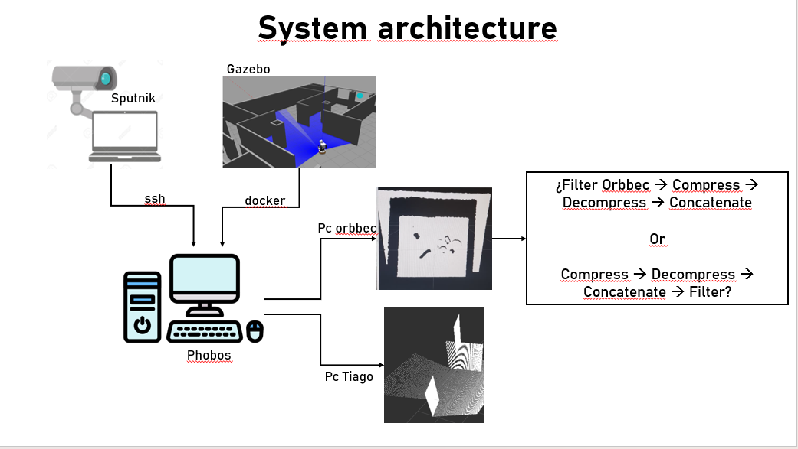
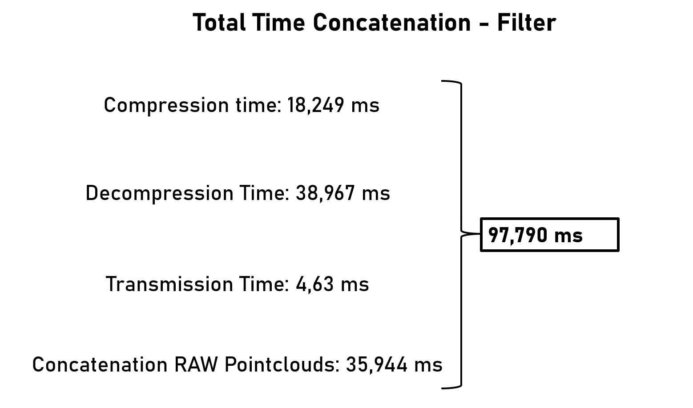

# TIAGo Perception System

Repositorio para el procesamiento, compresión y concatenación de nubes de puntos del robot TIAGo y cámaras externas (Sputnik/Orbbec). Desarrollado para el IOC-UPC.


## Estructura del Workspace

El repositorio  incluye:

- *`ros2_tiago_perception`*: Nodos de Filtrado con VAMP, Compresión, y Concatenación con Cloudini. Incluye la librería VAMP localmente. [Repositorio original VAMP](https://github.com/kavrakilab/vamp)

- *`cloudini`* : Repositorio Cloudini [Repositorio original Cloudini](https://github.com/facontidavide/cloudini)

- *`point_cloud_interfaces`* : Definición de mensajes personalizados (`CompressedPointCloud2`) requeridos por Cloudini. 

## Análisis de Rendimiento: Orden del Pipeline de Procesamiento

### 1. Arquitectura del sistema

Esta imagen muestra la estructura del sistema y como fluye la informacion/datos de entrada o salida 


### 2. Filtrar primero y luego concatenar
Los resultados experimentales determinaron que el orden óptimo es **Filtrar primero las nubes de puntos a usar (Orbbec y TIAGo) y luego realizar la concatenación**  basándose en las siguientes métricas:

1. **Reducción de carga computacional (CPU):** Al aplicar el filtro espacial (VAMP) sobre la nube en bruto, se descartan miles de puntos innecesarios (ruido, fuera del radio de interés o colisiones con el propio entorno). Al comprimir (Cloudini) *después* del filtrado, el algoritmo procesa un volumen de datos drásticamente menor, ahorrando ciclos de CPU.

2. **Optimización del ancho de banda:** Comprimir una nube previamente filtrada genera un *payload* (carga útil de red) mucho más ligero que comprimir la nube completa. Esto reduce la latencia de transmisión a través de la red local entre Sputnik y el TIAGo.

A continuacion se muestra un resumen de los resultados de las pruebas donde se puede observar los tiempos de ejecucion de cada proceso (Filtra - Concatenar vs Concatenar -Filtrar):




## Lanzamiento del nodo de la camara Orbbec Astra 2

Para conectarte remotamente:

```bash
ssh -X sputnik
```

Ejemplo de lanzamiento de rocker:

```bash
rocker --x11 --privileged --nvidia --user --home --env DISPLAY=$DISPLAY --env QT_X11_NO_MITSHM=1 --volume /tmp/.X11-unix:/tmp/.X11-unix /dev:/dev /home/projects:/home/projects --user-preserve-groups --network=host $1 "/usr/bin/terminator -l ioc:ros2-humble" # example of images to use: ioc:ros2-humble or ioc:ros2-jazzy
```

Lanzar nodo de la camara:

```bash
ros2 launch orbbec_camera astra2.launch.py depth_registration:=true enable_colored_point_cloud:=true
```


## Clonacion del repositorio

### 1. Clonar el repositorio

```bash
git clone https://github.com/JeremyD111/tiago_perception_system

cd tiago_perception_system
```


### 2. Compilar y cargar el entorno
```bash
colcon build  --cmake-args -DCMAKE_BUILD_TYPE=Release
source install/setup.bash

```


## Ejecución de Nodos

### 1. Filtrado y Compresión en el Origen (Sputnik / Orbbec)

Filtra la nube externa usando VAMP y la comprime usando Cloudini para enviarla por la red.

```bash
ros2 run ros2_tiago_perception vamp_cloudini_node --ros-args \
  -p sub_pointcloud_topic:=/camera/depth/points \
  -p use_vamp_filter:=true \
  -p filter_cull_radius:=1.55 \
  -p filter_radius:=0.02 \
  -r /point_cloud_topic:=/sputnik_cloud \
  -r /point_cloud_topic/compressed:=/sputnik_cloud/compressed
```


### 2. Descompresión en el Destino (TIAGo)

Este nodo recibe el mensaje `CompressedPointCloud2` comprimido que viajó por la red local desde Sputnik. Trabaja directamente sobre el mensaje crudo de DDS para maximizar la velocidad y reducir la latencia de CPU. 

Para descomprimir el tópico `/sputnik_cloud/compressed` a un formato `PointCloud2` regular que el TIAGo pueda entender, ejecuta:

```bash
ros2 run cloudini_ros cloudini_topic_converter --ros-args \
    -p compressing:=false \
    -p topic_input:=/sputnik_cloud/compressed \
    -p topic_output:=/sputnik_cloud/decompressed
```


### 3. Filtrado Pointclouds del TIAGo

En esta seccion, para ejemplificar el uso del nodo, se usa la nube de puntos del TIAGo proveniente del gazebo, sin embargo la finalidad real es intentar usar la nube de puntos reales de la camara del robot, sin embargo, esta sección ya fue trabajada por David Yu Wu. 

```bash
ros2 run ros2_tiago_perception vamp_filter_node2 --ros-args \
    -p sub_pointcloud_topic:=/head_front_camera/depth/points \
    -p filter_cull_radius:=1.55 \
    -p filter_radius:=0.02 \
    -r /point_cloud_topic:=/tiago_cloud_filtered
```

### 4. Concatenación de Nubes de Puntos (pointcloud_concatenate)

El paso final del pipeline es unificar las nubes de puntos de ambas fuentes (la externa de Sputnik ya descomprimida y la interna del TIAGo ya filtrada) en un solo entorno tridimensional. 

Este nodo toma las nubes independientes, usa `tf2` para transformarlas al mismo marco de referencia espacial (por defecto el centro del robot, `base_fixed_link`), y publica una nube consolidada.

Ejecuta el nodo conectando los tópicos resultantes de los pasos anteriores a las entradas del concatenador (`cloud_in1` y `cloud_in2`):

```bash
ros2 run ros2_tiago_perception pointcloud_concatenate_node --ros-args \
    -p clouds:=2 \
    -p target_frame:=base_fixed_link \
    -r cloud_in1:=/tiago_cloud_filtered \
    -r cloud_in2:=/sputnik_cloud/decompressed \
    -r cloud_out:=/tiago/merged_cloud
```

